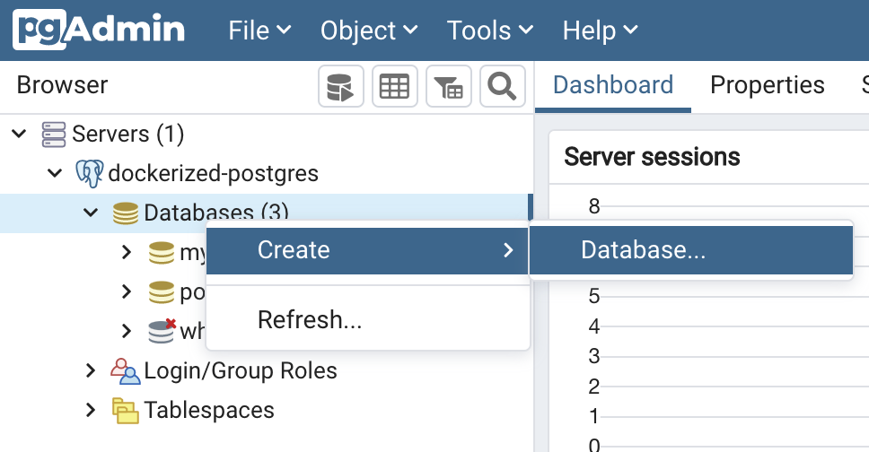
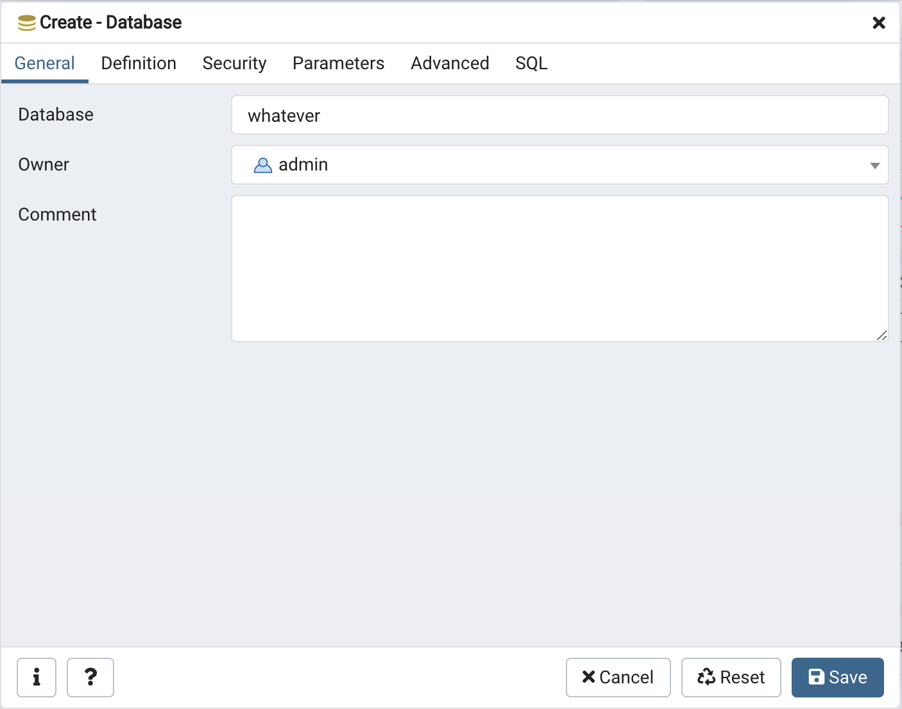

# Basics

## Creating a Database

- with psql

    ```shell
    CREATE DATABASE netflix;
    >> CREATE DATABASE;
    ```

- with pgAdmin 4

    
    

## Accessing a Database

- with psql

    ```shell
    \c whatever
    >> You are now connected to database "whatever" as user "admin".
    >> whatever=#
    ```

## Creating a Table

- with psql

    ```shell
    CREATE TABLE titles (
        show_id         int,
        type            varchar(10),
        title           varchar(256),
        director        varchar(256),
        actors          varchar(1000),
        country         varchar(128),
        date_added      Date,
        release_year    int,
        rating          varchar(10),
        duration        varchar(10),
        listed_in       varchar(128),
        description     varchar(1000)
    );
    ```

    Enter `\dt`to show tables.

## Populating a Table

- Import a CSV file into a table

    To populate our database we import a csv file with 6234 titles of Netflix Movies and TV Shows.
    The list was published by Shivam Bansal on [kaggle.com](https://www.kaggle.com/shivamb/netflix-shows).

    ```SQL
    COPY titles FROM '/data/netflix_titles.csv' CSV HEADER;
    ```

- Insert multiple Values

    ```SQL
    INSERT INTO ratings (rating, description)
    VALUES  ('G', 'General Audiences'),
            ('PG', 'Parental Guidance Suggested'),
            ('PG-13', 'Parents Strongly Cautioned'),
            ('R', 'Restricted'),
            ('NC-17', 'No one 17 and under admitted');
    ```

## Creating an Index

```SQL
CREATE UNIQUE INDEX show_idx ON titles (show_id);
```

## Defining a Primary Key

```SQL
ALTER TABLE titles
ADD PRIMARY KEY (show_id);
```
