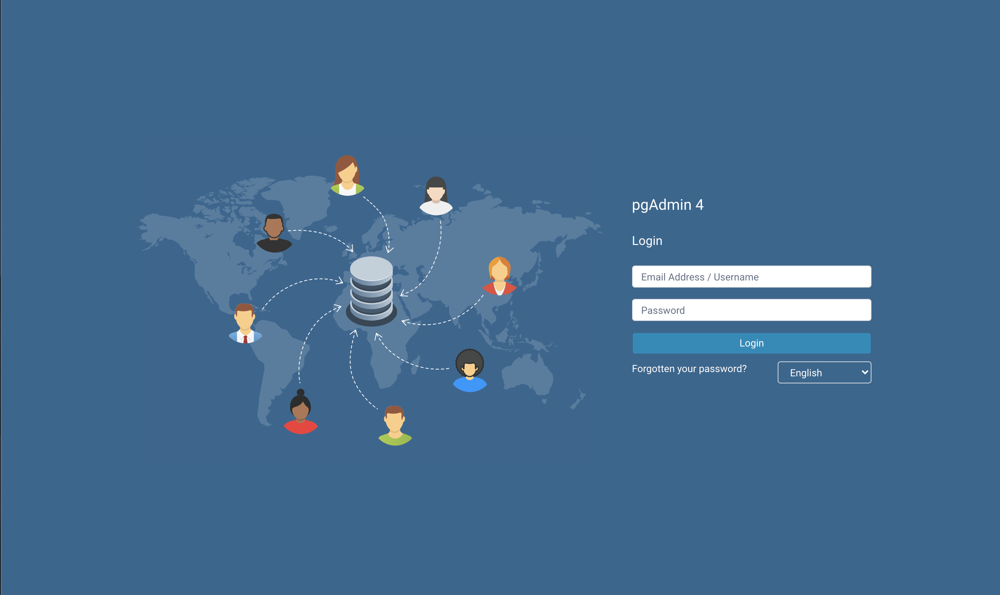
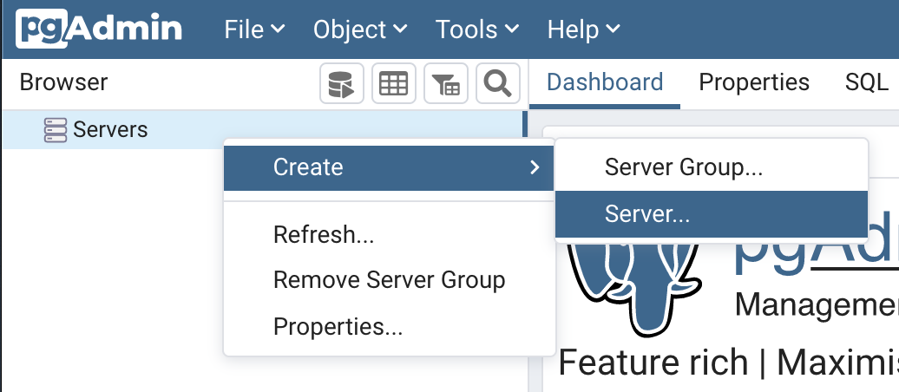
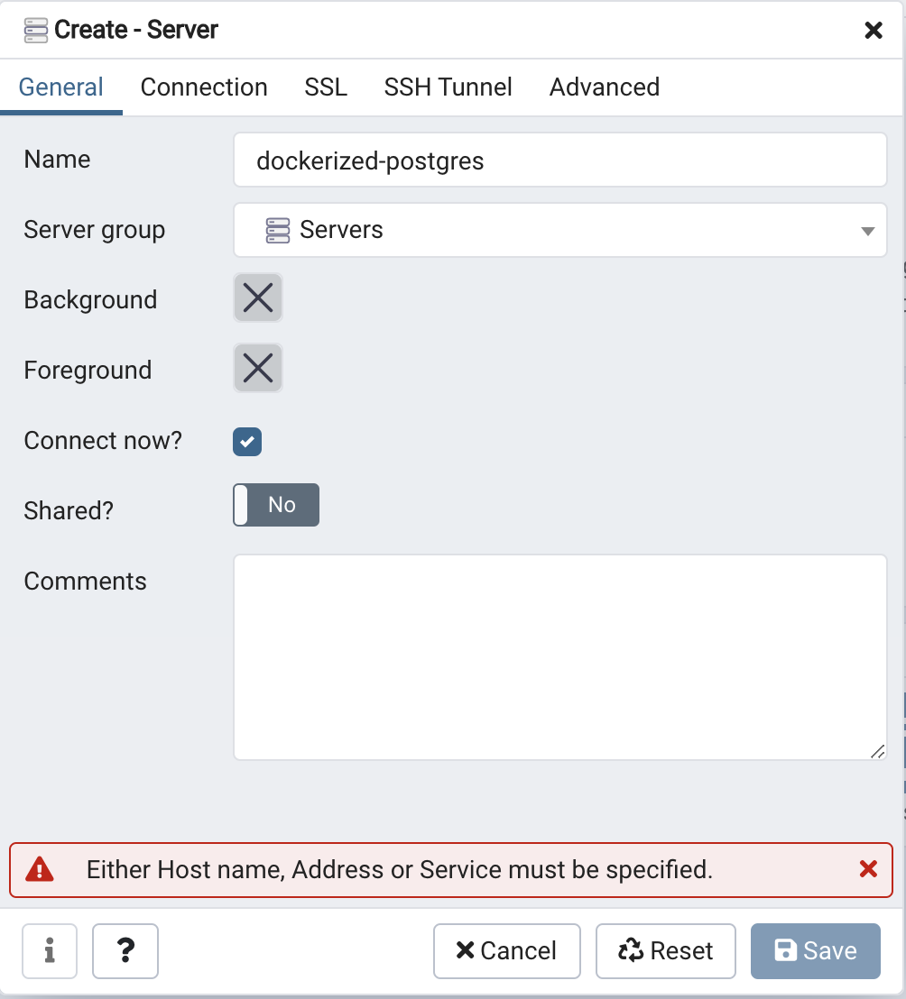
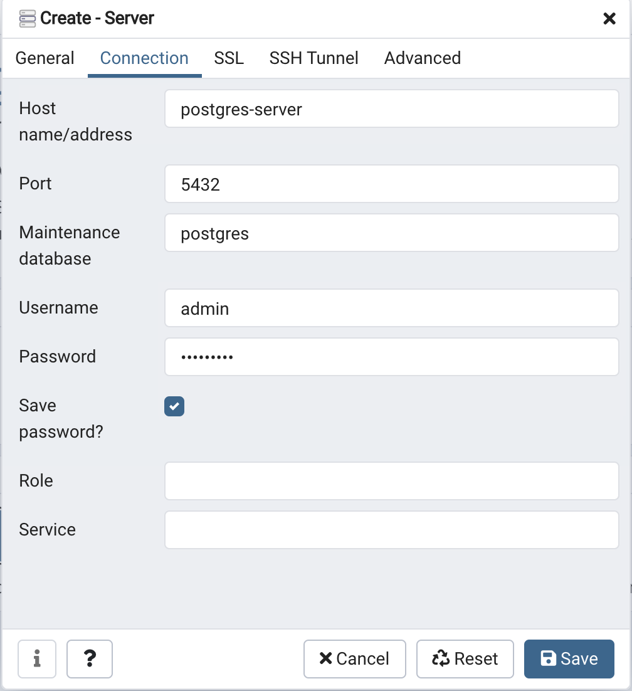
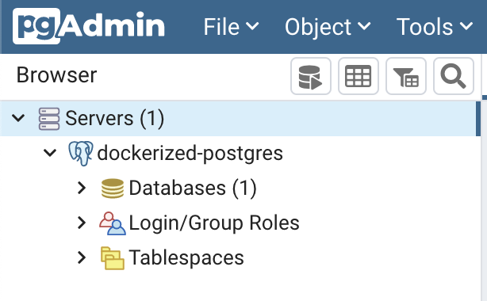

# Getting Started

## Setting up the Development Environment

The quickest way to get started is by running PostgreSQL in a Docker Container.

1. Install [Docker](https://docs.docker.com/get-docker/) and [Docker-Compose](https://docs.docker.com/compose/install/)

1. Run `docker-compose up-d`

1. Visit [http://localhost:8080/](http://localhost:8080/) in your Webbrowser to open pgAdmin4.
    

1. Login with `name@host.com` as **E-Mail** and `badsecret` as **Password**.

1. Right-Click on **Servers** and create a new Server.
    

1. In the General tab, enter a **Server Name** e.g. `dockerized-postgres`.
    

1. In the Connection tab, enter `postgres-server` as **Host**, `5432` as **Port**, `postgres` as **Maintenance database**, `admin` as **Username** and `bad secret` as **Password**. Check **Save Password?** and click on **Save**.
    

1. PgAdmin should now be successfully connected.
    

You can always stop your Development Environment by entering `docker-compose down`.